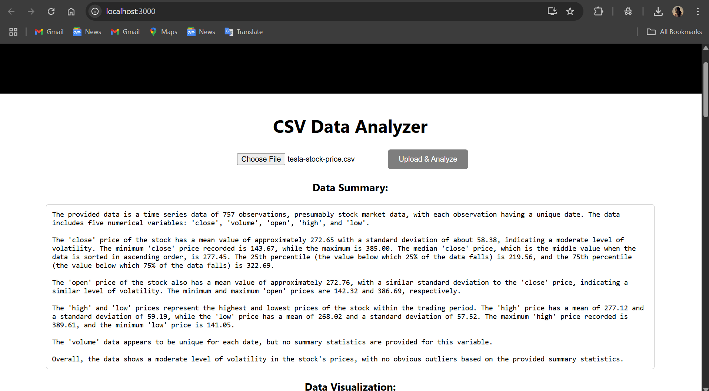
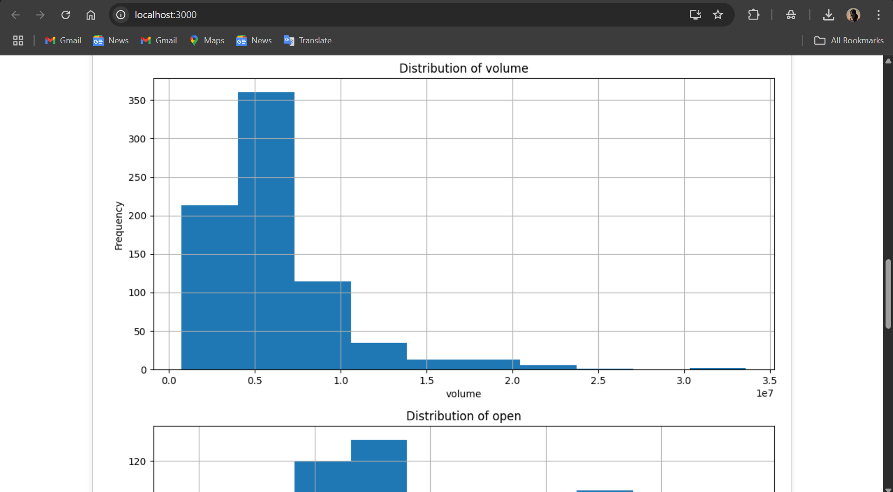

# CSV Data Analyzer with LangGraph

## Overview

This project is a data analysis application that processes CSV files, generates textual summaries, and provides data visualizations. It's built using Python (Flask) for the backend, React for the frontend, and LangGraph for orchestrating the data processing and analysis.

## Features

* **CSV File Upload:** Users can upload CSV files through a user-friendly interface.
* **Data Summarization:** The application uses an LLM (GPT-4) to generate an insightful textual summary of the uploaded CSV data, including key statistics and observations.
* **Data Visualization:** The application generates histograms to visualize the distribution of numerical data within the CSV file.
* **Modular Design:** The application is designed with a modular architecture, separating the frontend, backend, and data processing logic.
* **LangGraph Integration:** LangGraph is used to define the workflow for data summarization and visualization.

## Technologies Used

* **Frontend:** React
* **Backend:** Flask (Python)
* **Data Processing & Orchestration:** LangChain, LangGraph
* **LLM:** GPT-4
* **Visualization:** Matplotlib
* **File Storage:** Local file system

## Installation

### Prerequisites

* Python 3.x
* Node.js
* pip (Python package installer)
* An OpenAI API key

### Backend Setup

1.  **Clone the repository:**
    ```bash
    git clone <your_repository_url>
    cd csv-agent-backend
    ```
2.  **Create a virtual environment (optional but recommended):**
    ```bash
    python -m venv venv
    source venv/bin/activate  # On Linux/macOS
    venv\Scripts\activate  # On Windows
    ```
3.  **Install dependencies:**
    ```bash
    pip install -r requirements.txt
    ```
4.  **Set up environment variables:**
    * Create a `.env` file in the `csv-agent-backend` directory.
    * Add your OpenAI API key to the `.env` file:
        ```
        OPENAI_API_KEY=your_openai_api_key
        ```
5.  **Run the Flask application:**
    ```bash
    python app.py
    ```

### Frontend Setup

1.  **Navigate to the frontend directory:**
    ```bash
    cd csv-agent-frontend
    ```
2.  **Install dependencies:**
    ```bash
    npm install
    ```
3.  **Run the React application:**
    ```bash
    npm start
    ```

## Usage

1.  Open the application in your browser (usually at `http://localhost:3000`).
2.  Upload a CSV file using the file input.
3.  The application will process the file, and then display:
    * A textual summary of the data.
    * Histograms visualizing the distribution of the numerical data.

## Screenshots

Here’s what the app looks like:





## Project Structure


├── csv-agent-backend/  # Backend code
│   ├── app.py           # Flask application
│   ├── tools/           # LangChain tools
│   │   ├── generate_summary.py # Generates CSV summary
│   │   ├── visualize_csv.py   # Generates CSV visualizations
│   ├── uploads/         # Directory for uploaded files and generated plots
│   ├── .env             # Environment variables (API keys)
│   └── requirements.txt # Python dependencies
├── csv-agent-frontend/ # Frontend code
│   ├── src/           # React source code
│   │   ├── App.js       # Main application component
│   │   ├── UploadForm.jsx # Handles file upload and display
│   │   ├── App.css      # Global styles
│   │   └── ...        # Other React components
│   ├── public/        # Static assets
│   ├── package.json   # npm dependencies
│   └── ...
└── README.md          # Project documentation (this file)


## LangGraph Flow

The LangGraph graph in `app.py` defines the following workflow:

1.  **Summarize:** The `generate_csv_summary` tool is called to generate a textual summary of the uploaded CSV data.
2.  **Visualize:** The `visualize_csv` tool is called to generate histograms of the numerical data.
3.  The results from both steps are then returned to the frontend.

## Notes

* The backend saves uploaded CSV files and generated plots in the `uploads/` directory. Ensure that this directory has the necessary write permissions.
* The application assumes that the uploaded CSV files contain numerical data that can be visualized with histograms.
* Error handling is included to catch potential issues during file upload, data processing, and visualization.

## Author

**Anvita Manne**  
